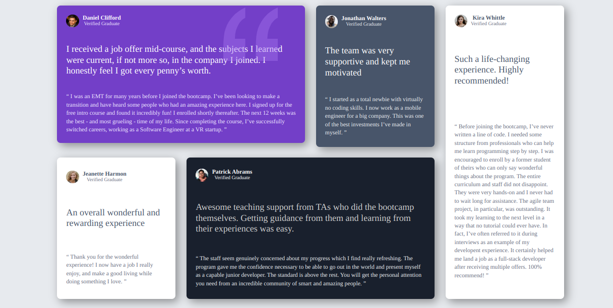
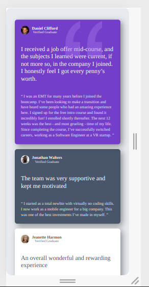

# Frontend Mentor - Testimonials grid section solution

This is a solution to the [Testimonials grid section challenge on Frontend Mentor](https://www.frontendmentor.io/challenges/testimonials-grid-section-Nnw6J7Un7). Frontend Mentor challenges help you improve your coding skills by building realistic projects. 

## Table of contents

- [Overview](#overview)
  -
  - [Screenshot](#screenshot)
  - [Links](#links)

  - [Built with](#built-with)
  
 - [Author](#author)

## Overview

### Screenshot

### Links

- Solution URL: [https://github.com/CoderAlchemy24/frme-testimonials-grid](https://github.com/CoderAlchemy24/frme-testimonials-grid)
- Live Site URL: [https://luminous-mousse-fdd01c.netlify.app/](https://luminous-mousse-fdd01c.netlify.app)

### Built with

- HTML5 markup
- CSS custom properties
- Flexbox
- CSS Grid

## Author

- Author - [@coderalchemy24](https://www.your-site.com)

